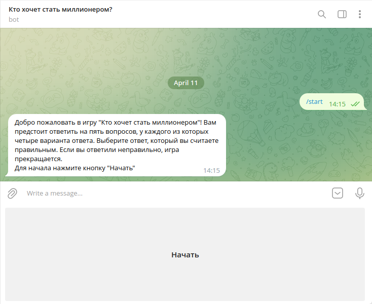
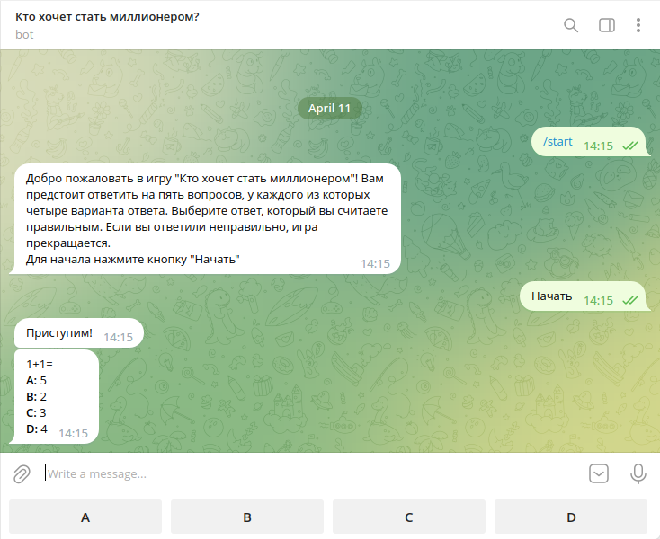
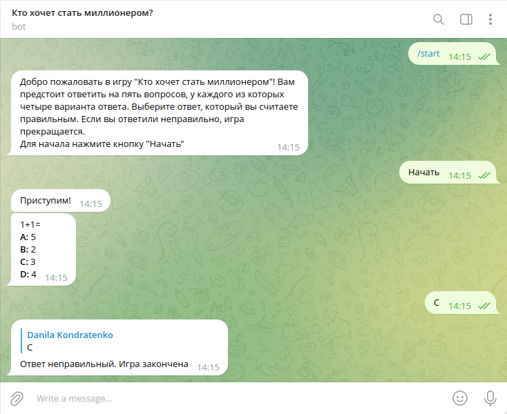
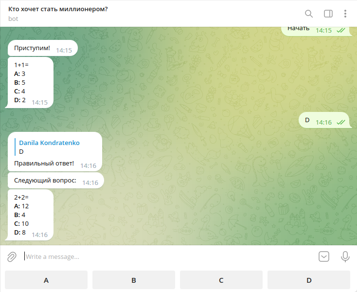
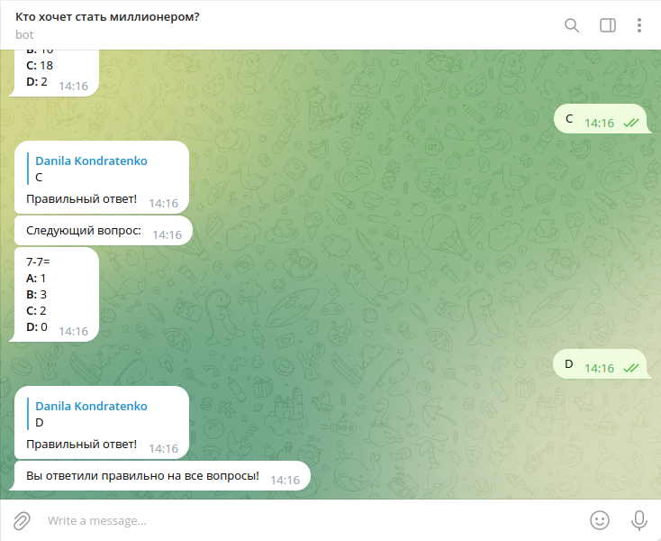

# Лабораторная работа №2

**Задание:** Создать телеграм-бот «Кто хочет стать миллионером?» (5 вопросов).

## Принцип работы игры

Даётся вопрос, на каждый из которых даётся 4 варианта ответа, притом только один из них является правильным.
Если человек даёт правильный ответ, игра продолжается (или завершается, если игрок ответил на все вопросы).
Если же человек отвечает неправильно, то игра прекращается.

Запуск игры осуществляется командой `/start`.

## Скриншоты работы

Рисунок 1 &mdash; Начало работы

Рисунок 2 &mdash; Пример вопроса

Рисунок 3 &mdash; Неправльный ответ

Рисунок 4 &mdash; Правильный ответ

Рисунок 5 &mdash; Конец игры